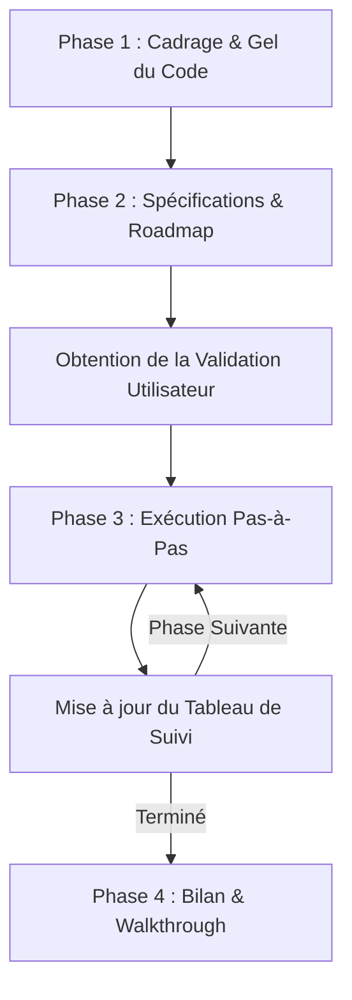

# Workflow de Refactoring Étape-par-Étape

Guide méthodologique complet pour mener à bien un refactoring propre, maîtrisé et sans régression.

---

## 📋 Directives Générales & Principes Fondamentaux

1. **Règle d'or : GEL INITIAL DE CODE**
   - **Aucune modification de code** ne doit être effectuée lors du premier échange.
   - Le premier objectif est d'écouter, recueillir les idées brutes et comprendre la nouvelle architecture souhaitée.

2. **Planification Rigoureuse & Transparente**
   - Rédiger systématiquement un document de **Spécifications Fonctionnelles et Techniques**.
   - Structurer le travail sous forme de **Roadmap découpée en phases d'implémentation atomiques**.
   - Maintenir un **Tableau de suivi de l'avancement** mis à jour après chaque étape.

3. **Validation Système**
   - Obtenir l'accord explicite de l'utilisateur sur le plan (`implementation_plan.md`) avant d'écrire la moindre ligne de code.
   - Respecter strictement les règles projet (ex: exécution des tests unitaires uniquement à la demande explicite de l'utilisateur).

---

## 🔄 Les 4 Phases du Workflow de Refactoring

---

### Phase 1 : Cadrage & Recueil des Idées Brutes
1. Confirmer l'absence de modification de code immédiate.
2. Demander à l'utilisateur de fournir ses idées brutes :
   - Nouveaux besoins UX/UI.
   - Changements de disposition / layout (ex: 2 colonnes, sidebar, zones de contenu).
   - Composants à déplacer, fusionner ou supprimer (ex: passage d'une modale vers une vue inline).
   - Harmonisation du style CSS et des tokens de design.

---

### Phase 2 : Rédaction des Spécifications & Roadmap (`implementation_plan.md`)
Créer l'artefact `implementation_plan.md` contenant :
1. **Document de Spécifications** :
   - Contexte et objectifs.
   - Diagramme d'architecture des composants (Mermaid).
   - Flux de données et d'événements.
2. **Roadmap par Phase** :
   - Découpage en phases fonctionnelles (Ex: Phase 1 : Migration données, Phase 2 : UI Header, Phase 3 : Vues inline, Phase 4 : Harmonisation CSS).
   - Liste de tâches atomiques avec numérotation (`Tâche 1.1`, `Tâche 1.2`, etc.).
3. **Tableau de Suivi de l'Avancement (Tracking Table)** :
   - Table Markdown récapitulative avec colonnes (`ID`, `Tâche`, `Statut`, `Remarques`).
   - Statuts utilisés : `⏳ À faire`, `🔄 En cours`, `✅ Fait`.

*Interrompre l'exécution et attendre l'accord de l'utilisateur.*

---

### Phase 3 : Exécution Pas-à-Pas (Step-by-Step Execution)
Pour chaque Phase de la Roadmap :
1. **Création / Modification des Composants** :
   - Appliquer la séparation des responsabilités (découper les grands composants en sous-composants autonomes si nécessaire).
   - Adopter les règles de design de l'application (glassmorphism, typographie compacte inline, boutons harmonisés).
   - Maintenir les contrats d'API Vue/TS (props, emits, types).
2. **Nettoyage du Code Obsolète** :
   - Retirer les anciennes sections, modales dupliquées et imports inutilisés au fur et a mesure.
3. **Mise à Jour du Tracking** :
   - À la fin de chaque phase terminée, mettre à jour l'artefact `implementation_plan.md` en cochant les tâches accomplies et en mettant à jour le tableau de suivi.

---

### Phase 4 : Bilan, Walkthrough & Livrables
1. **Compte-Rendu Final (`walkthrough.md`)** :
   - Rédiger le document résumé récapitulant :
     - Les fichiers créés, modifiés et supprimés.
     - Les nouvelles fonctionnalités et améliorations UI/UX apportées.
     - L'état final du projet.
2. **Vérification & Validation** :
   - Vérifier qu'aucune erreur TypeScript ou de linter ne subsiste.
   - Présenter la synthèse finale à l'utilisateur.
