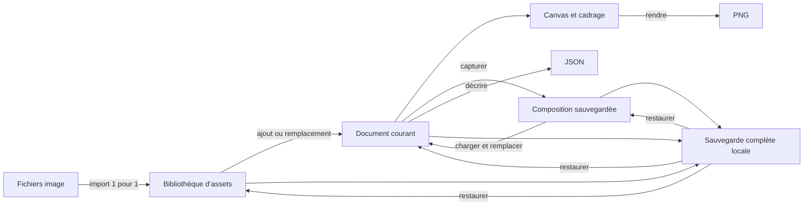

# Vision produit — Incroyaux News Studio

> État documenté : 28 août 2026, à partir de l’application et du code du dépôt.

## Identité du produit

- **Nom du projet technique :** BerluCreator.
- **Nom présenté dans l’interface :** Incroyaux News Studio.
- **Nature :** studio local de composition graphique 2D spécialisé dans la création de scènes de plateau.
- **Sorties principales :** image PNG propre et description JSON de la scène.

BerluCreator transforme une bibliothèque de sprites en un petit studio graphique ciblé. L’utilisateur ne part pas d’un canevas générique : il choisit des expressions, des postures, des accessoires et des éléments de décor déjà structurés, puis les assemble directement sur le plateau.

## Intention globale

L’intention du produit est de **réduire le temps entre une idée éditoriale et une image de plateau exploitable**.

Le studio privilégie une composition rapide et guidée :

- les assets sont classés selon leur rôle dans la scène ;
- les pièces d’un personnage sont manipulées comme un tout cohérent ;
- les règles de remplacement évitent d’empiler accidentellement plusieurs têtes, bouches ou arrière-plans ;
- le rendu visible est l’unique état à comprendre et à exporter ;
- les compositions utiles peuvent être mémorisées puis rappelées sans réassembler la scène.

Le produit a volontairement quitté une logique de timeline et de keyframes. Sa valeur actuelle n’est pas de produire une animation, mais de fabriquer et réutiliser des **compositions statiques** de manière fiable.

## Problème adressé

Créer à répétition des visuels à partir de nombreux sprites entraîne plusieurs frictions : retrouver le bon fichier, respecter l’ordre visuel, garder les proportions, recomposer un personnage cohérent et reproduire un cadrage déjà utilisé.

Incroyaux News Studio concentre ces décisions dans une interface spécialisée :

1. sélectionner un personnage ou une zone du plateau ;
2. choisir les variantes graphiques adaptées ;
3. positionner et redimensionner les ensembles importants ;
4. cadrer le résultat ;
5. sauvegarder la composition ou exporter l’image.

## Utilisateurs visés

Le dépôt ne contient pas d’étude utilisateur formelle. Les profils ci-dessous constituent donc la **cible produit déduite du fonctionnement actuel** :

- un créateur de contenu qui produit des illustrations récurrentes pour « Incroyaux News » ;
- un membre d’une petite équipe éditoriale qui doit décliner rapidement une scène connue ;
- un graphiste ou opérateur qui maintient un pack de sprites et prépare les rendus finaux.

Le produit suppose une utilisation sur ordinateur, avec souris ou dispositif de pointage, dans un navigateur moderne. L’interface plein écran et les interactions de redimensionnement ne ciblent pas aujourd’hui un usage mobile.

## Proposition de valeur

**Composer une scène éditoriale cohérente en quelques clics, sans manipuler manuellement les fichiers sources ni reconstruire le personnage pièce par pièce dans un logiciel graphique généraliste.**

Les différenciateurs actuels sont :

- une taxonomie d’assets adaptée aux personnages et aux plateaux ;
- un personnage disponible sous forme de sprite complet ou de rig assemblé ;
- des règles de cardinalité et de placement intégrées au domaine ;
- des compositions nommées, rechargeables avec miniature ;
- un fonctionnement local sans backend à administrer.

## Principes produit

### 1. Le visible est la source de vérité

Il n’existe qu’un document d’édition courant. La scène affichée est la scène modifiable et exportable. Il n’y a ni étape cachée, ni timeline, ni état temporel à synchroniser.

### 2. Un clic doit avoir un résultat prévisible

Cliquer sur un asset l’ajoute. Cliquer sur une autre variante d’un emplacement singleton la remplace. Cliquer à nouveau sur l’asset visible le retire.

### 3. Un personnage reste une unité

Même lorsqu’il est constitué de plusieurs sprites, un personnage se sélectionne, se déplace et se redimensionne comme un seul objet. Ses proportions naturelles sont conservées.

### 4. Les fichiers importés ne sont pas altérés

Le contrat est « un fichier image = un asset ». L’original et ses dimensions sont conservés. Le recadrage alpha n’est utilisé que pour produire une miniature de navigation plus lisible.

### 5. Les erreurs doivent être récupérables

L’historique permet d’annuler les mutations de scène. Lors d’un import multiple, un échec n’annule pas les autres fichiers et peut être retenté. Une suppression d’asset est refusée si elle casserait une composition sauvegardée.

### 6. Le stockage local doit rester compréhensible

Le produit distingue deux intentions : enregistrer une composition réutilisable et sauvegarder l’état complet de l’application. Ces deux actions ne couvrent pas le même périmètre.

## Modèle mental

Les concepts structurants sont :

- **Asset :** image source et métadonnées de classement.
- **Calque :** utilisation d’un asset dans la scène.
- **Groupe :** unité logique de transformation, notamment un personnage.
- **Document courant :** groupes, calques et caméra du plateau actif.
- **Composition sauvegardée :** copie nommée du document courant avec miniature.
- **Sauvegarde complète :** copie locale du projet, du document, des assets, des blobs et des compositions.

## Parcours principal

1. Au premier lancement, le studio crée un espace de travail unique et installe le pack de sprites de démonstration.
2. Une visite guidée présente la bibliothèque, le plateau, la sauvegarde et l’export.
3. L’utilisateur explore les assets par personnage, partie du rig ou catégorie de décor, avec recherche par nom ou tag.
4. Un clic ajoute un asset à la scène. Pour un personnage, il choisit implicitement entre représentation complète et rig selon l’asset sélectionné.
5. Sur le canvas, il sélectionne, déplace et redimensionne le personnage ou l’élément libre. Undo/redo protège l’exploration.
6. Il peut activer un cadrage caméra et choisir les dimensions du plateau.
7. Il enregistre une composition réutilisable, crée une sauvegarde complète locale ou exporte le rendu.

## Deux niveaux de conservation

| Besoin                            | Fonction                | Contenu                                                  | Effet du chargement                                    |
| --------------------------------- | ----------------------- | -------------------------------------------------------- | ------------------------------------------------------ |
| Retrouver une mise en scène       | Composition sauvegardée | Miniature, caméra, groupes et calques                    | Remplace le document courant et vide l’historique      |
| Protéger tout l’espace de travail | Sauvegarde complète     | Projet, document, assets, fichiers image et compositions | Remplace toutes les données courantes de l’application |

La sauvegarde complète est stockée dans la même base locale que l’application. Elle protège contre une mauvaise modification ou un reset partiel, mais **pas** contre la suppression des données du navigateur, la perte de la machine ou un changement de navigateur.

## Périmètre actuel et non-objectifs

Le produit actuel est :

- mono-utilisateur ;
- mono-espace de travail ;
- local au navigateur ;
- centré sur une scène statique ;
- optimisé pour le bureau ;
- spécialisé dans un vocabulaire de personnage et de plateau.

Ne font pas partie du produit livré :

- animation, timeline, keyframes ou export vidéo ;
- comptes, synchronisation cloud ou collaboration ;
- publication directe vers un CMS ou un réseau social ;
- retouche bitmap, suppression de fond, découpe de spritesheet ou dessin libre ;
- gestion de plusieurs projets depuis l’interface ;
- sauvegarde complète téléchargeable sous forme de fichier.

## Indicateurs de valeur suggérés

Le dépôt ne collecte aucune télémétrie. Si le produit évolue, les indicateurs suivants seraient cohérents avec son intention :

- temps médian entre l’ouverture du studio et le premier export PNG ;
- nombre moyen de clics ou d’actions pour produire une scène ;
- taux de réutilisation des compositions sauvegardées ;
- fréquence des imports en erreur et des restaurations de sauvegarde ;
- part des scènes utilisant un personnage complet plutôt qu’un rig ;
- nombre de compositions exportées sans passage par un logiciel externe.

## Points à clarifier pour la suite

Ces décisions ne sont pas tranchées par le code actuel :

- « BerluCreator » doit-il rester le nom du produit ou uniquement celui du dépôt ?
- le studio est-il réservé à « Incroyaux News » ou doit-il devenir un outil générique de personnages éditoriaux ?
- la prochaine priorité est-elle la portabilité des données, le multi-projet ou l’enrichissement de la composition ?
- le JSON est-il un format d’archivage interne, une API d’intégration ou seulement un outil de diagnostic ?

Ces réponses permettront de faire évoluer cette vision d’une description fidèle du produit actuel vers un véritable document de stratégie produit.
